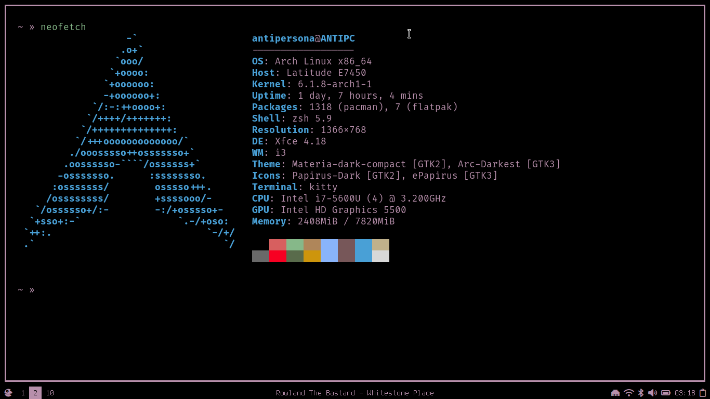
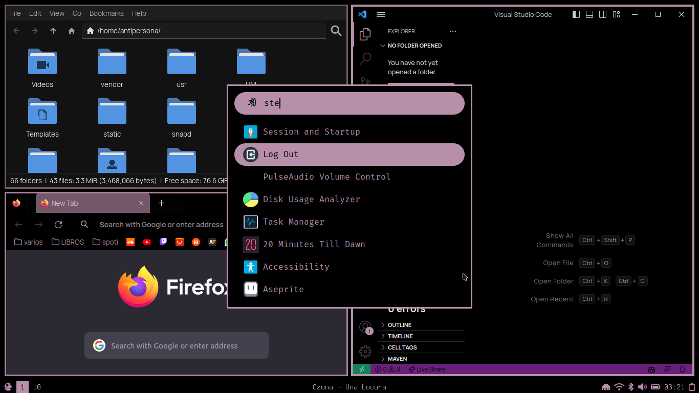
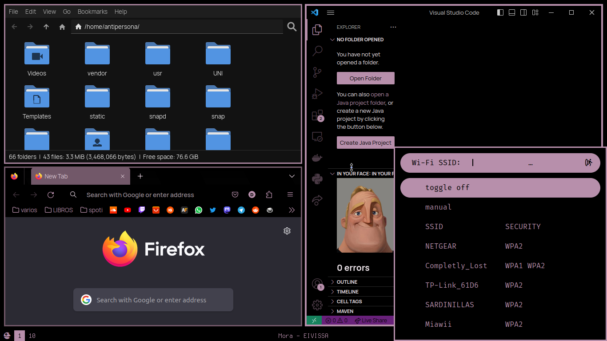
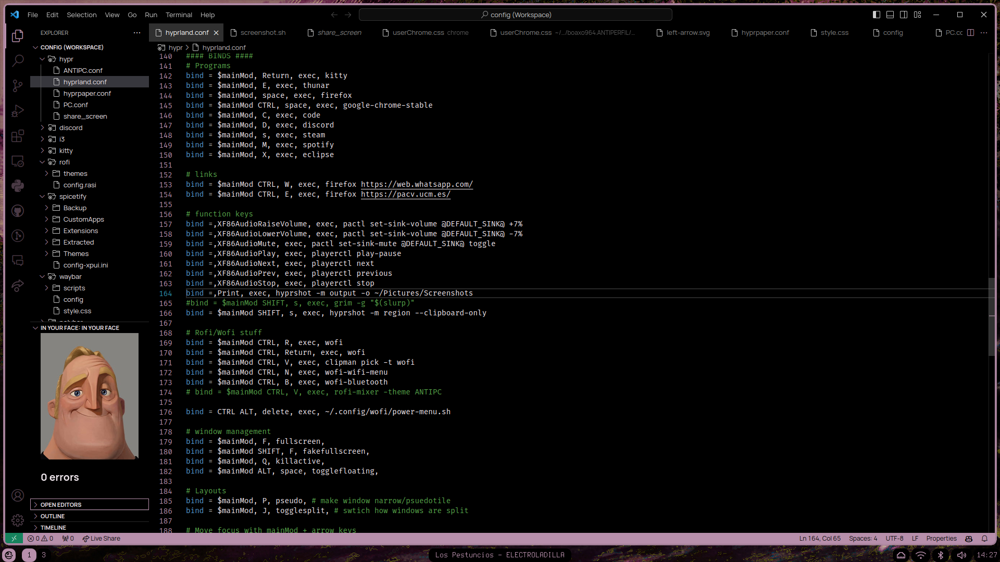
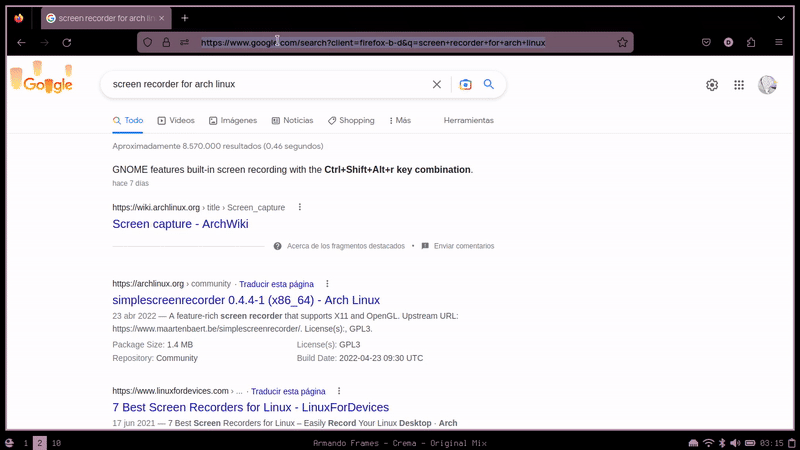
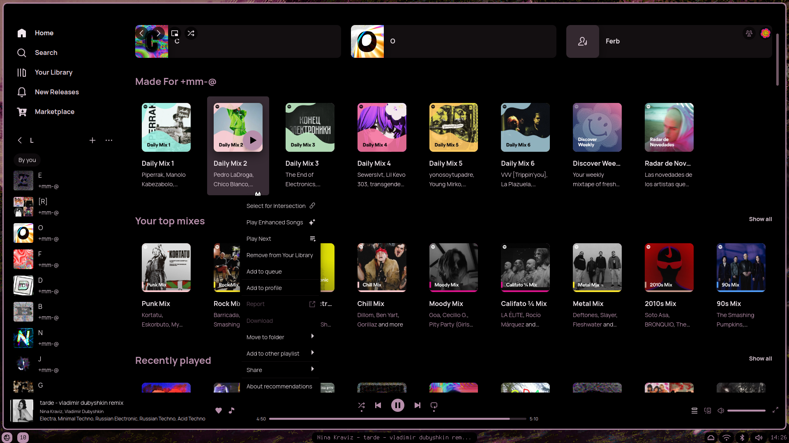

ANTITEMA:

This is the theme that i use in my computer.
    
There are two modalities: the pink one and the more purple. The good one is the purple one, the pink one is an adaptation of the colors so they look like the purple in my laptop screen.


The chrome folder is a theme for firefox. It should be placed into ~/.mozilla/firefox/<profile>/chrome/ and the chrome folder should be placed into ~/.mozilla/firefox/<profile>/ (in my case). You can check where is your .mozilla folder by typing about:profiles in the address bar of firefox.

The rest of the folders should be placed on ~/.config/


- The spicetify theme was made using Onepunch theme by okarin001 as a base.
    https://github.com/okarin001/Onepunch

- Betterdiscord theme is a small modification of amoled-cord by LuckFire.
    https://github.com/LuckFire/amoled-cord
    
- Slightly modified version of the rounded theme for rofi by LR-Tech.
    https://github.com/lr-tech/rofi-themes-collection

- For the icons in the polybar i use awesome-font.
    https://fontawesome.com/









For vsCode, you will need to add the following lines to your settings.json file:

```
"workbench.colorCustomizations": {
    //    #000000; // black
    //    #efe6ec  // almost white
    //    #b78fab; // purple
    //    #a6829b  // dark purple
    //    #725866; // darker purple   
    //    https: //code.visualstudio.com/api/references/theme-color

    //BASE COLORS
    "focusBorder": "#b78fab",
    "foreground": "#efe6ec",
    "widget.border": "#b78fab",
    "widget.shadow": "#000000",
    "selection.background": "#725866",
    "icon.foreground": "#b78fab",
    "sash.hoverBorder": "#b78fab",

    //WINDOW BORDER
    "window.activeBorder": "#b78fab",
    "window.inactiveBorder": "#725866",

    //TEXT COLORS
    "textCodeBlock.background": "#000000",
    "textLink.activeForeground": "#efe6ec",
    "textLink.foreground": "#b78fab",
    "textPreformat.foreground": "#b78fab",
    "textSeparator.foreground": "#b78fab",
 
    //BUTTONS
    "button.foreground": "#000000",
    "button.background": "#b78fab",
    "button.hoverBackground": "#efe6ec",
    "button.secondaryForeground": "#000000",
    "button.secondaryBackground": "#a6829b",

    //LIST AND TREES
    "list.activeSelectionBackground": "#725866",
    "activityBar.foreground": "#b78fab",
    "activityBarBadge.background": "#b78fab",
    "activityBarBadge.foreground": "#000000",

    //STATUS BAR COLORS
    "statusBar.background": "#b78fab",
    "statusBar.foreground": "#000000",

    //EDITOR 
    "editor.foreground": "#efe6ec",
    "editorLineNumber.foreground": "#b78fab",
    "editorCursor.foreground": "#b78fab",
    "editor.selectionBackground": "#725866",

    //BACKGROUND COLORS
    "editor.background": "#000000",
    "sideBar.background": "#000000",
    "activityBar.background": "#000000",
    "tab.activeBackground": "#303030",
    "tab.inactiveBackground": "#000000",
    "tab.border": "#000000",
    "editorGroup.emptyBackground": "#000000",
    "editorGroupHeader.tabsBackground": "#000000",
    "editorGroupHeader.noTabsBackground": "#000000",
    "menu.background": "#000000",
    "quickInputTitle.background": "#000000",
    "editorWidget.background": "#000000",
    "editorSuggestWidget.background": "#000000",
    "input.background": "#000000",
    "titleBar.activeBackground": "#000000",
},
"window.titleBarStyle": "custom",
```

I dont use any wallpaper but this was my inspiration for the theme.
It was made by me, from an original piece by Jose Segrelles.
 

    
