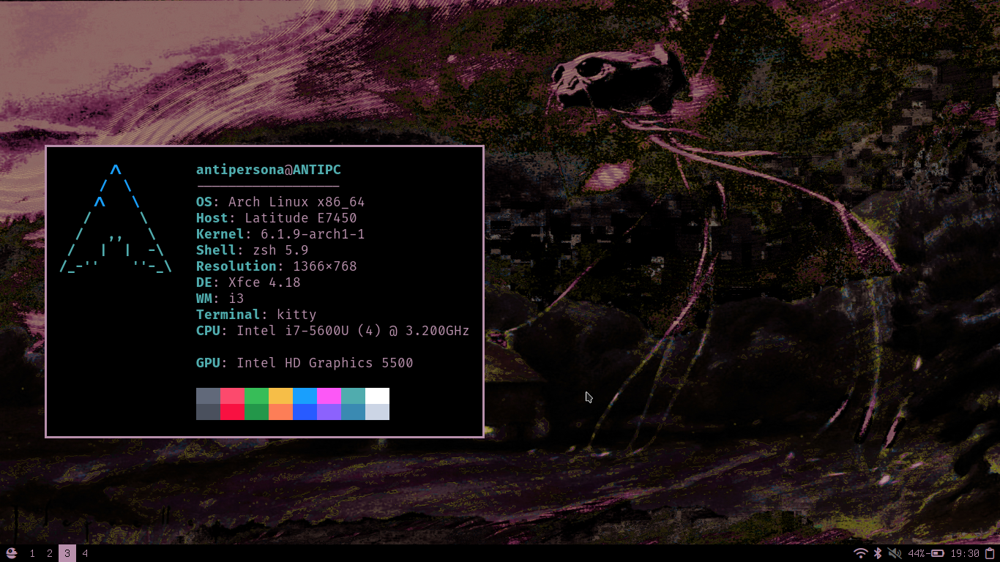

# ANTITEMA:

This is the theme that i use in my laptop and in my PC.

Checkout the [hyprland](https://github.com/antipersona/ANTITEMA/tree/Hyprland) and the [i3](https://github.com/antipersona/ANTITEMA/tree/i3) branches to see how it looks in those environments.

In this branch you can find a merge of all the dots used by those branches. They are compatible with each other, so you can have and i3 and a hyprland setup in the same machine using this branch.

I will put here some screenshots, the guide for the installation of some of the programs and the dependencies:


### Images



### Installation
The chrome folder is a theme for firefox. It should be placed into ~/.mozilla/firefox/[profile]/chrome/ (in my case). You can check where is your .mozilla folder by typing about:profiles in the address bar of firefox.

The rest of the folders should be placed on ~/.config/


### VSCode
For vsCode, you will need to add the following lines to your settings.json file:

```
"workbench.colorCustomizations": {
    //    #000000; // black
    //    #efe6ec  // almost white
    //    #b78fab; // purple
    //    #a6829b  // dark purple
    //    #725866; // darker purple   
    //    https: //code.visualstudio.com/api/references/theme-color

    //BASE COLORS
    "focusBorder": "#b78fab",
    "foreground": "#efe6ec",
    "widget.border": "#b78fab",
    "widget.shadow": "#000000",
    "selection.background": "#725866",
    "icon.foreground": "#b78fab",
    "sash.hoverBorder": "#b78fab",

    //WINDOW BORDER
    "window.activeBorder": "#b78fab",
    "window.inactiveBorder": "#725866",

    //TEXT COLORS
    "textCodeBlock.background": "#000000",
    "textLink.activeForeground": "#efe6ec",
    "textLink.foreground": "#b78fab",
    "textPreformat.foreground": "#b78fab",
    "textSeparator.foreground": "#b78fab",
 
    //BUTTONS
    "button.foreground": "#000000",
    "button.background": "#b78fab",
    "button.hoverBackground": "#efe6ec",
    "button.secondaryForeground": "#000000",
    "button.secondaryBackground": "#a6829b",

    //LIST AND TREES
    "list.activeSelectionBackground": "#725866",
    "activityBar.foreground": "#b78fab",
    "activityBarBadge.background": "#b78fab",
    "activityBarBadge.foreground": "#000000",

    //STATUS BAR COLORS
    "statusBar.background": "#b78fab",
    "statusBar.foreground": "#000000",

    //EDITOR 
    "editor.foreground": "#efe6ec",
    "editorLineNumber.foreground": "#b78fab",
    "editorCursor.foreground": "#b78fab",
    "editor.selectionBackground": "#725866",

    //BACKGROUND COLORS
    "editor.background": "#000000",
    "sideBar.background": "#000000",
    "activityBar.background": "#000000",
    "tab.activeBackground": "#303030",
    "tab.inactiveBackground": "#000000",
    "tab.border": "#000000",
    "editorGroup.emptyBackground": "#000000",
    "editorGroupHeader.tabsBackground": "#000000",
    "editorGroupHeader.noTabsBackground": "#000000",
    "menu.background": "#000000",
    "quickInputTitle.background": "#000000",
    "editorWidget.background": "#000000",
    "editorSuggestWidget.background": "#000000",
    "input.background": "#000000",
    "titleBar.activeBackground": "#000000",
},
"window.titleBarStyle": "custom",
```


### Notifications
Notifications deppend of the wm (find them in each branch readme)


### Wallpaper
It was made by me, from an original piece by Jose Segrelles.
 


### Dependencies and some programs used
- [polybar](https://github.com/polybar/polybar) 
- [rofi](https://github.com/davatorium/rofi)
- [rofi-wifi-menu](https://github.com/zbaylin/rofi-wifi-menu) to fix the empty password bug check this [issue](https://github.com/zbaylin/rofi-wifi-menu/issues/22)
- [rofi-bluetooth](https://github.com/nickclyde/rofi-bluetooth)
- [rofi-power-menu](https://github.com/jluttine/rofi-power-menu)
- [rofi-mixer](https://github.com/joshpetit/rofi-mixer)
- [spiceify](https://spicetify.app/)
- [betterdiscord](https://github.com/BetterDiscord/BetterDiscord)
- [herbe](https://github.com/dudik/herbe)
- [i3-volume](https://github.com/hastinbe/i3-volume)
- [greenclip](https://github.com/erebe/greenclip)

- The spicetify theme was made using [Onepunch](https://github.com/okarin001/Onepunch) theme by okarin001 as a base.
- Betterdiscord theme is a small modification of [amoled-cord](https://github.com/LuckFire/amoled-cord) by LuckFire.  
- Slightly modified version of the [rounded theme for rofi](https://github.com/lr-tech/rofi-themes-collection) by LR-Tech. 
- For the icons I use [awesome-font](https://fontawesome.com/).